# Windows Server Home Lab

## Overview

This project demonstrates the design, deployment, and administration of a Windows Server enterprise environment in Oracle VirtualBox.

The lab simulates a small business network and includes:

- Active Directory Domain Services (AD DS)
- Organizational Unit (OU) Structure
- Group Policy Management
- DHCP Server Deployment
- DNS Integration
- File Server Administration
- NTFS Permissions
- Shared Folder Access Control
- Domain-Joined Windows Client Management

The environment was built from scratch using Windows Server 2022 and Windows 11.

---

# Lab Architecture

```text
                    +----------------+
                    |      DC01      |
                    |----------------|
                    | Active Directory
                    | DNS Server
                    | DHCP Server
                    | File Server
                    +--------+-------+
                             |
                    192.168.56.0/24
                             |
                    +--------+-------+
                    |    CLIENT01    |
                    |----------------|
                    | Windows 11
                    | Domain Joined
                    +----------------+
```

Domain:

```text
lab.local
```

---

# Technologies Used

- Windows Server 2022
- Windows 11
- Active Directory
- Group Policy
- DHCP
- DNS
- NTFS Permissions
- SMB File Sharing
- Oracle VirtualBox

---

# Project 1 – Active Directory Deployment

## Objectives

- Install Active Directory Domain Services
- Promote server to Domain Controller
- Create Organizational Units
- Join Windows client to domain
- Configure Group Policy

---

## Domain Controller Configuration

Server configured as:

```text
Hostname: DC01
Domain: lab.local
IP Address: 192.168.56.10
```

### Domain Controller

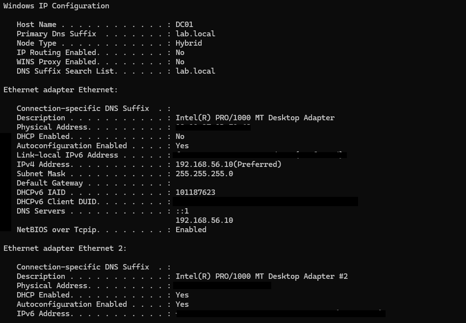

---

## Domain Join Verification

CLIENT01 successfully joined the domain.

### Domain User Login

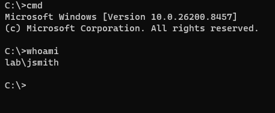

---

## Organizational Unit Structure

Created departmental OUs:

- HR
- IT
- Sales
- Servers
- Workstations

### OU Structure

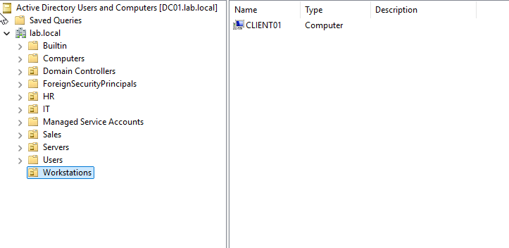

---

## Group Policy Configuration

Created and linked a custom Group Policy Object.

Policy Settings:

- Minimum Password Length: 10
- Password Complexity Enabled

### Group Policy

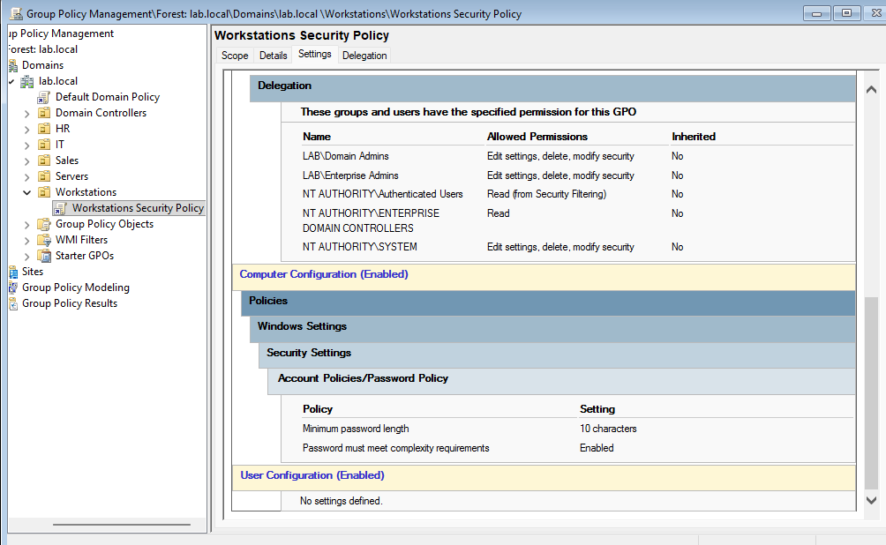

---

## Policy Verification

Validated using:

```powershell
gpresult /scope computer /r
```

### GPO Verification

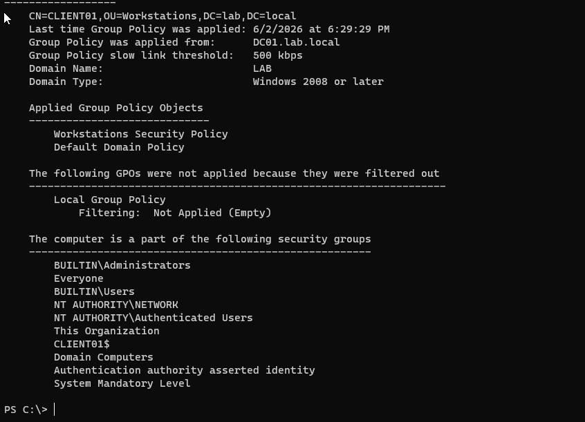

---

# Project 2 – File Server & NTFS Permissions

## Objectives

- Create department shares
- Configure NTFS permissions
- Configure SMB shares
- Restrict access using security groups

---

## Department Shares Created

Created:

```text
C:\Shares\HR
C:\Shares\IT
C:\Shares\Sales
```

## Security Groups

Created:

```text
HR_RW
IT_RW
Sales_RW
```

### Security Groups

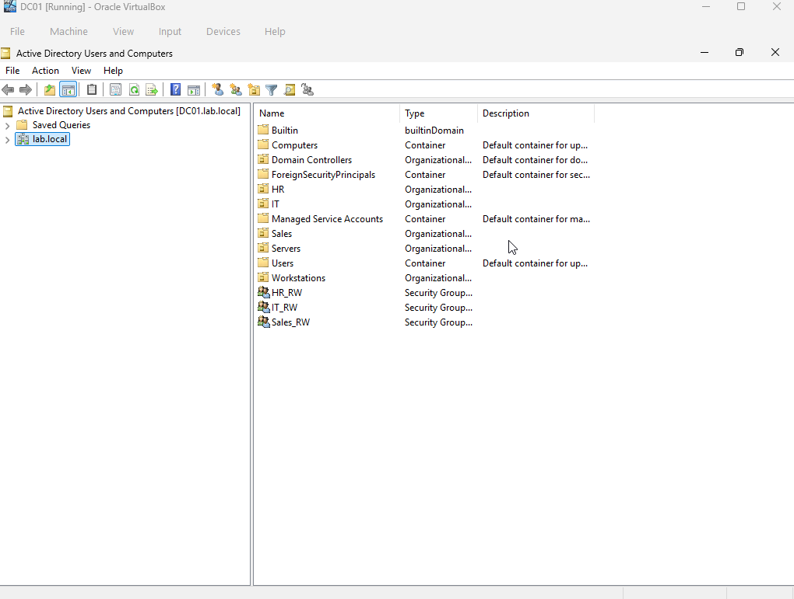

---

## NTFS Permissions

Configured folder-level permissions using Active Directory groups.

### IT Folder Permissions

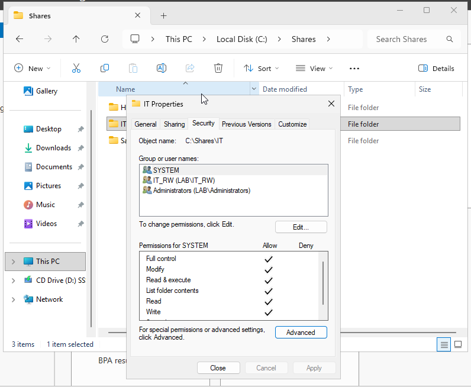

---

## SMB Share Configuration

Configured network shares for department access.

### Share Permissions

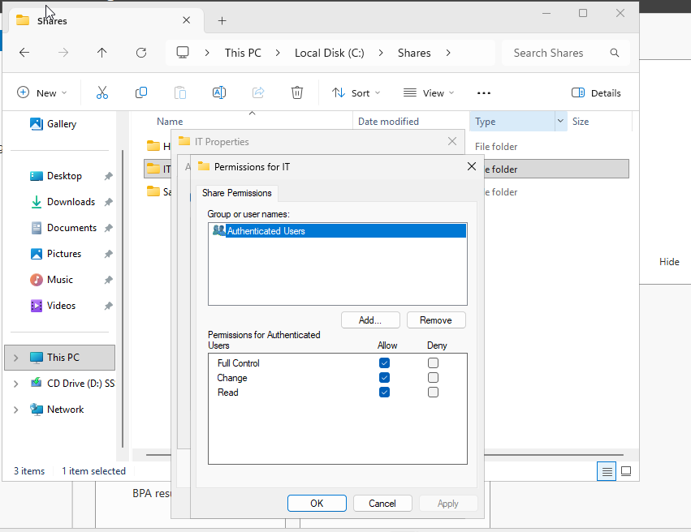

---

## Access Validation

Validated successful and denied access scenarios.

### IT Share Access

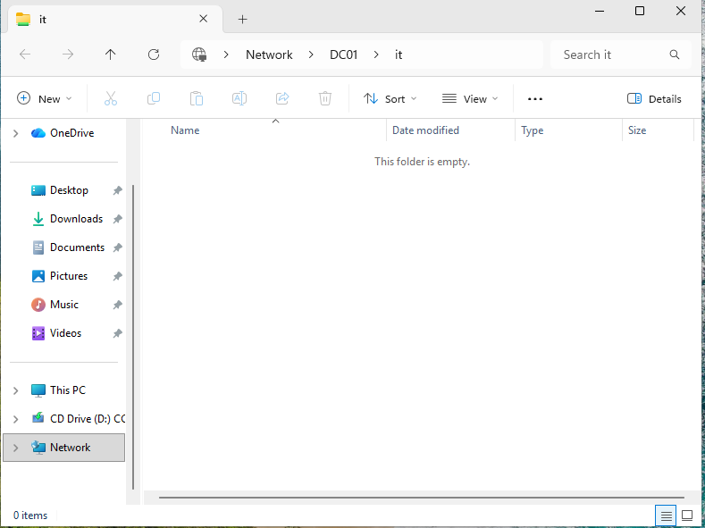

### HR Share Access Denied

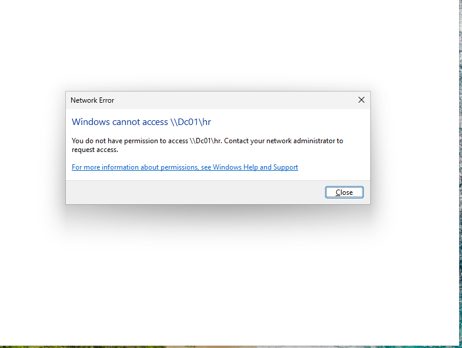

---

# Project 3 – DHCP Server Deployment

## Objectives

- Install DHCP role
- Create DHCP scope
- Configure DHCP options
- Lease IP addresses
- Validate DNS integration

---

## DHCP Installation

DHCP role installed and authorized.

### DHCP Role

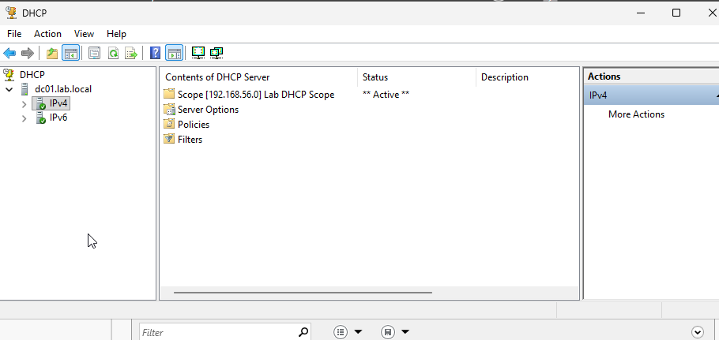

---

## DHCP Scope

Created scope:

```text
192.168.56.0/24
```

### DHCP Scope

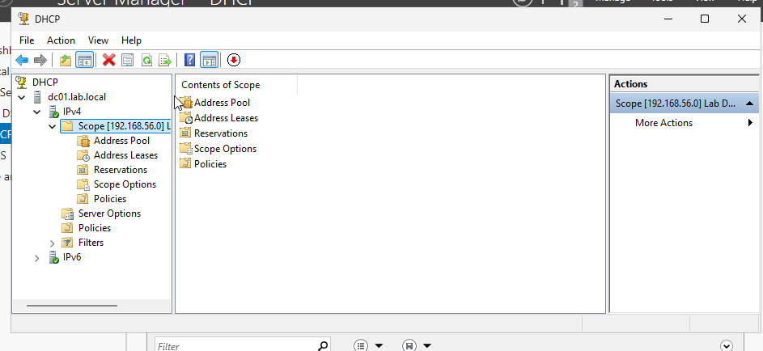

---

## DHCP Options

Configured:

| Option | Value |
|----------|----------|
| Router | 192.168.56.1 |
| DNS Server | 192.168.56.10 |
| Domain Name | lab.local |

### DHCP Options

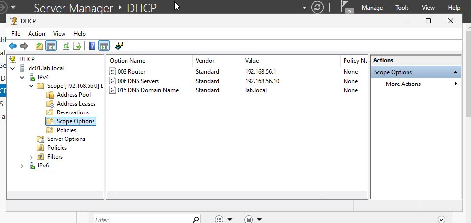

---

## Client Lease

CLIENT01 received DHCP configuration.

### DHCP Lease

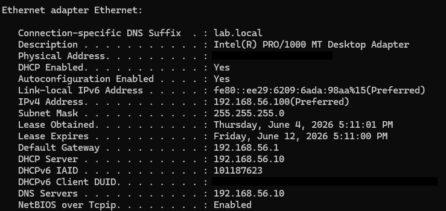

---

## Lease Verification

Verified in DHCP console.

### Lease Verification

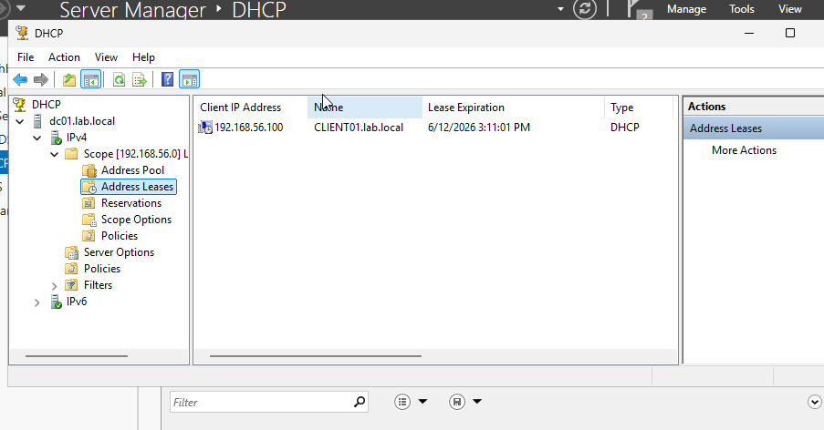

---

## DNS Troubleshooting

Identified incorrect DNS server entries being distributed by DHCP.

### DNS Misconfiguration

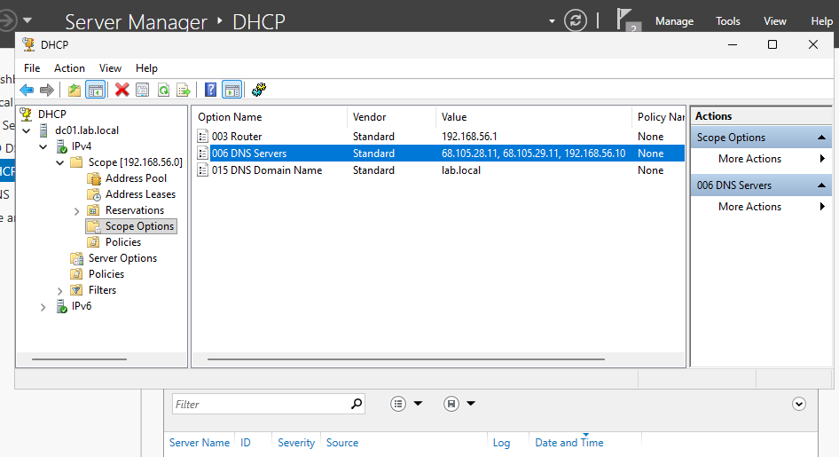

---

## DNS Remediation

Updated DHCP Option 006 to use:

```text
192.168.56.10
```

### DNS Fixed

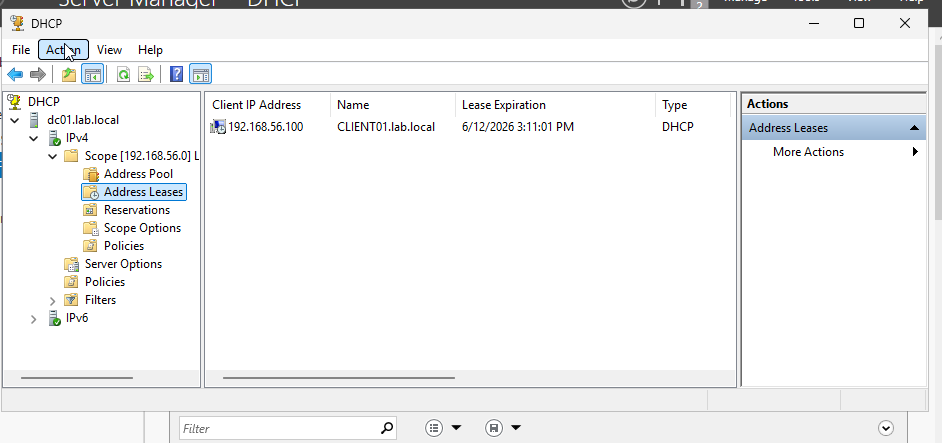

---

## DNS Validation

Validated Active Directory name resolution.

```powershell
nslookup lab.local
```

### DNS Resolution

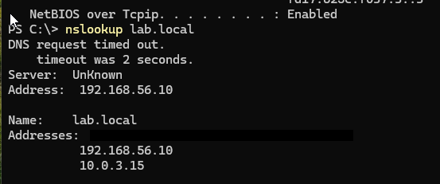

---

# Skills Demonstrated

## Windows Administration

- Windows Server Deployment
- Active Directory Administration
- Group Policy Management
- User and Computer Management

## Networking

- DHCP Configuration
- DNS Administration
- IP Address Management
- Network Troubleshooting

## Security

- NTFS Permissions
- Access Control
- Security Groups
- Authentication and Authorization

## Infrastructure

- Virtualization
- Enterprise Services
- Client/Server Architecture
- Microsoft Server Technologies

---

# Lessons Learned

- Active Directory relies heavily on proper DNS configuration.
- DHCP Option 006 is critical for domain functionality.
- Security groups simplify permission management.
- Group Policy provides centralized administration.
- NTFS and Share permissions work together to enforce access control.

---

# Author

Brandon Cooper

Aspiring Cybersecurity Analyst | System Administrator | Active Directory | Networking | Windows Infrastructure
